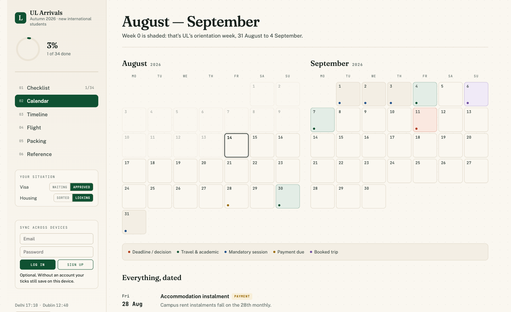

[](https://appwrite.io/)
[](https://developer.mozilla.org/docs/Web/HTML)
[](https://developer.mozilla.org/docs/Web/JavaScript)
[](./LICENSE)

An arrival planner for new international students starting at the University of Limerick in Autumn 2026 — checklist, calendar, customs rules, transport notes and contacts in a single page that works offline.

Check out the live site [here](https://ul-arrivals-2026.appwrite.network).

Built while planning one move from Delhi to Limerick, using facts scattered across a dozen UL pages and emails. Shared in case it saves someone else the digging. Ticks save locally by default; signing in syncs them across devices.

The site lives in [sites/ul-arrivals](./sites/ul-arrivals) as one self-contained `index.html` — no build step, no dependencies. The repo root keeps [appwrite.config.json](./appwrite.config.json) and convenience scripts.

## Development

```bash
bun run dev      # serves the site on :8080
bun run deploy   # push to Appwrite Sites
bun run domain   # repoint the stable domain at the new deployment
```

Or just open `sites/ul-arrivals/index.html` in a browser.

## Contributing

Dates, fees and immigration rules shift every intake. If you spot something out of date, open an issue or a PR — a correction from someone who has just been through it beats anything verifiable from a browser.

Everything here was checked against `ul.ie` and Irish government sources in August 2026, and none of it is official University of Limerick material.

## License

This project is licensed under the MIT License. See the [LICENSE](LICENSE) file for details.
